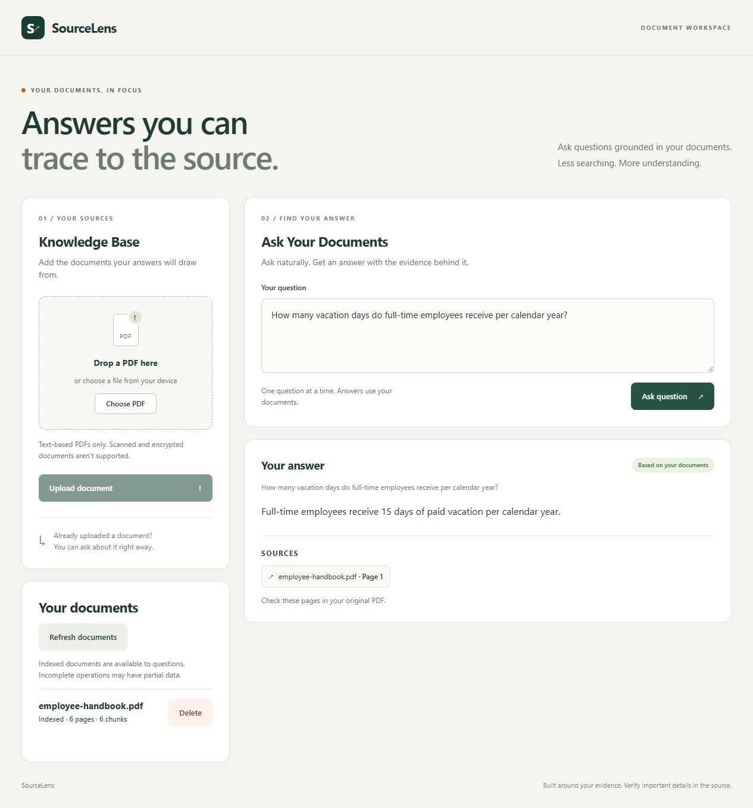
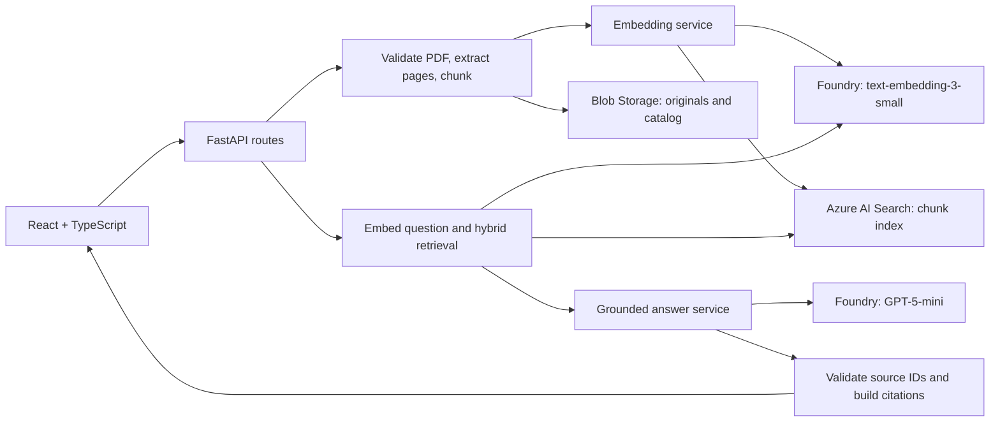

# SourceLens

**An Azure-powered RAG document intelligence platform with hybrid retrieval, grounded generation, validated citations, evaluation, and document lifecycle management.**

Finding a policy in a collection of PDFs takes time. A generated answer is only useful if you can check its evidence. SourceLens lets users upload text-based PDFs, ask natural-language questions, and receive answers with document/page citations. When retrieved passages do not support an answer, it returns an insufficient-evidence response.

Built with **Python 3.12, FastAPI, React, TypeScript, Azure AI Search, Azure Blob Storage, and Microsoft Foundry**.

**Status:** Local end-to-end flows have been verified against live Azure services. Public-demo restrictions and offline Docker container verification are complete. Frontend/backend hosting has **not been deployed**, and there is no public hosted demo or CD pipeline.

[Demo](#demo) · [Features](#technical-features) · [Architecture](#architecture) · [Evaluation](#measured-evaluation-results) · [Run locally](#run-locally) · [Documentation](#technical-documentation)

## Demo

Upload a PDF, ask a question, and receive a grounded answer with page-level citations.

### Example outputs

Recorded from the clean `employee-handbook.pdf` demo corpus on October 8, 2026:

| Question | Answer | Citation |
| --- | --- | --- |
| How many vacation days do full-time employees receive per calendar year? | Full-time employees receive 15 days of paid vacation per calendar year. | `employee-handbook.pdf`, page 1 |
| How many days per week may employees work remotely, and whose approval is required? | Employees may work remotely for up to three days per week, with manager approval required. | `employee-handbook.pdf`, page 2 |
| What is the capital of Japan? | The retrieved documents do not contain enough evidence to answer this question. | None; `insufficient_evidence` |

The reproducible 26-case Azure evaluation uses the versioned synthetic evaluation corpus and is reported separately in the [Evaluation section](#measured-evaluation-results) below.

[Recorded demo responses](docs/demo-results.json) · [Reproduce the local demo](docs/development.md#run-the-complete-local-application)

## Technical features

- **Page-aware ingestion:** Extract PDF text page by page, create token-aware chunks within page boundaries, and preserve document/page/chunk metadata. Batch embedding and indexing calls.
- **Hybrid retrieval:** Combine keyword search over chunk text with vector similarity in a single Azure AI Search query. Keep retrieval independently inspectable through `POST /api/retrieval`.
- **Grounded generation:** Supply retrieved passages to GPT-5-mini, validate returned source IDs, and construct citations from trusted backend metadata. Unsupported questions receive an explicit abstention response.
- **Document lifecycle:** Detect identical PDF bytes using SHA-256, return duplicate conflicts without re-indexing, list document states, and remove Search chunks before deleting owned originals. A Blob-backed catalog and lease coordinate changes without a database.
- **Evaluation and reliability:** Separate retrieval metrics from generation/citation checks, preserve baseline runs, and use a controlled corpus to investigate duplicate-document effects.
- **Keyless Azure access:** Use Microsoft Entra authentication in the backend, with managed identity configured for planned hosting. Keep Azure credentials out of the frontend.

Citation validation establishes source provenance; it does not guarantee that every generated claim is semantically supported. That distinction is reflected in the evaluation design.

## Architecture

A modular monolith keeps API routes thin, service orchestration readable, and Azure SDK integrations isolated.

The diagram shows data flow. Ingestion confirms embeddings, original storage, and Search indexing before reporting success; it is not an atomic transaction across services. [Failure and recovery behavior](docs/lifecycle.md#states-concurrency-and-failure-behavior)

| Layer | Technology and responsibility |
| --- | --- |
| Frontend | React, TypeScript, Vite; uploads, questions, answers, citations, document listing/deletion |
| Backend | Python 3.12, FastAPI, Pydantic; typed contracts, validation and orchestration |
| PDF processing | pypdf and tiktoken; text extraction and page-bounded token chunks |
| Azure AI Search | Keyword/vector retrieval and chunk metadata; HNSW with cosine similarity |
| Microsoft Foundry | `text-embedding-3-small` with 1,536-dimensional vectors; GPT-5-mini for grounded answers |
| Azure Blob Storage | Private PDF originals and document lifecycle catalog |
| Identity | Microsoft Entra via `DefaultAzureCredential`; Azure CLI locally, managed identity for planned hosting |
| Quality and packaging | pytest, Vitest, React Testing Library, TypeScript checks; non-root Python Docker image |

Planned hosting uses **Azure Static Web Apps Free** and **Azure Container Apps Consumption**. Hosting configuration is prepared, not deployed. No database, agent framework, Kubernetes, or background workers are involved.

## Measured evaluation results

Two live Azure runs used the same **26-case synthetic handbook dataset**: 18 supported questions and 8 unsupported questions across six document sections. Both used `top_k=5` and the same model, chunking, prompt, retrieval and scoring settings.

| Metric | Baseline v1: shared corpus | Controlled Corpus v1: one handbook copy |
| --- | ---: | ---: |
| Retrieval Hit@1 | 83.3% (15/18) | 83.3% (15/18) |
| Retrieval Hit@3 | 88.9% (16/18) | 94.4% (17/18) |
| Expected-page recall in top 5 | 94.4% | 100% |
| Supported / insufficient-evidence classification | 96.2% (25/26) | 100% (26/26) |
| Citation precision against expected sources | 83.3% | 100% |
| Combined citation checks passed | 80.8% (21/26) | 100% (26/26) |
| Deterministic answer checks passed | 96.2% (25/26) | 100% (26/26) |

**Engineering finding:** Isolating one handbook copy improved source selection without ranking or prompt tuning. This motivated content-hash duplicate prevention and explicit document lifecycle management. The remaining Hit@3 miss shows that corpus cleanup did not solve every retrieval-ranking issue.

These are results from a small, controlled synthetic dataset, **not a general accuracy benchmark**. Answer checks use explicit expected facts/patterns and abstention criteria; they do not assess every possible semantic error. Citation metrics measure expected-source matching and provenance, not a guarantee of factual entailment.

[Methodology, limitations and reproduction commands](docs/evaluation.md) · [Versioned dataset](backend/evaluation/handbook.json) · [Published metrics and artifact hashes](docs/evaluation-results.json)

## Run locally

Requires Python 3.12 and Node.js 22.12+ (or 24 LTS). The full application also requires configured Azure resources and an Entra identity with the documented roles. Unit tests mock Azure; live smoke tests and evaluations are separate, explicit commands that consume Azure resources.

1. Follow the [backend setup and configuration](docs/development.md#set-up-the-backend) and [Azure integration configuration](docs/rag.md).
2. Start FastAPI and Vite using the [two-terminal instructions](docs/development.md#run-the-complete-local-application).
3. Open `http://127.0.0.1:5173`. Use `/docs` on the backend to inspect API contracts, including the retrieval debugging endpoint.

Latest local verification: **366 backend tests and 42 frontend tests passed**, along with TypeScript checks and a production frontend build using a test HTTPS API URL. [Test commands](docs/development.md#run-tests) · [Container verification](docs/deployment.md#reproducible-packaging-and-local-checks)

## Scope and security

- Current scope: text-based PDFs, a shared document collection, and single-turn questions. OCR, user accounts, conversation memory, agents, semantic ranking and production deployment are not implemented.
- Public demo mode allows bounded anonymous questions over one approved synthetic handbook; upload, deletion and diagnostic routes are blocked server-side. Full document management remains trusted development only. Hosting starts with an IP restriction and requires security verification before public access; CORS is not authentication. [Access policy and future authenticated RAG](docs/public-access.md)
- Never commit `.env` or credentials. `VITE_*` values are public browser configuration. Retrieved documents are untrusted content and must not override application instructions.
- Blob and Search changes are not transactional. Failed operations remain visible and retryable; crashes may require manual stale-lease recovery. [Lifecycle limitations and recovery](docs/lifecycle.md)

## Technical documentation

| Guide | Contents |
| --- | --- |
| [Local development](docs/development.md) | Installation, environment configuration, Entra login, local servers, upload checks and tests |
| [RAG implementation](docs/rag.md) | Extraction, chunking, embeddings, Search schema, retrieval, grounding and individual Azure smoke tests |
| [Document lifecycle](docs/lifecycle.md) | Duplicate detection, listing/deletion contracts, consistency, legacy documents and recovery |
| [Evaluation](docs/evaluation.md) | Dataset, metrics, failure diagnosis, controlled-corpus experiment and live evaluation commands |
| [Public access](docs/public-access.md) | Demo isolation, anonymous usage limits and future authentication/ownership requirements |
| [Deployment](docs/deployment.md) | Docker, production settings, HTTPS/CORS, managed identity/RBAC, probes, IP restrictions and manual deployment |
| [Repository instructions](AGENTS.md) | Architecture principles, testing expectations, security rules and milestone boundaries |

Previously named KnowledgeOps. Existing `KNOWLEDGEOPS_*` configuration keys, Azure index names, and synthetic handbook filenames are retained for compatibility.
